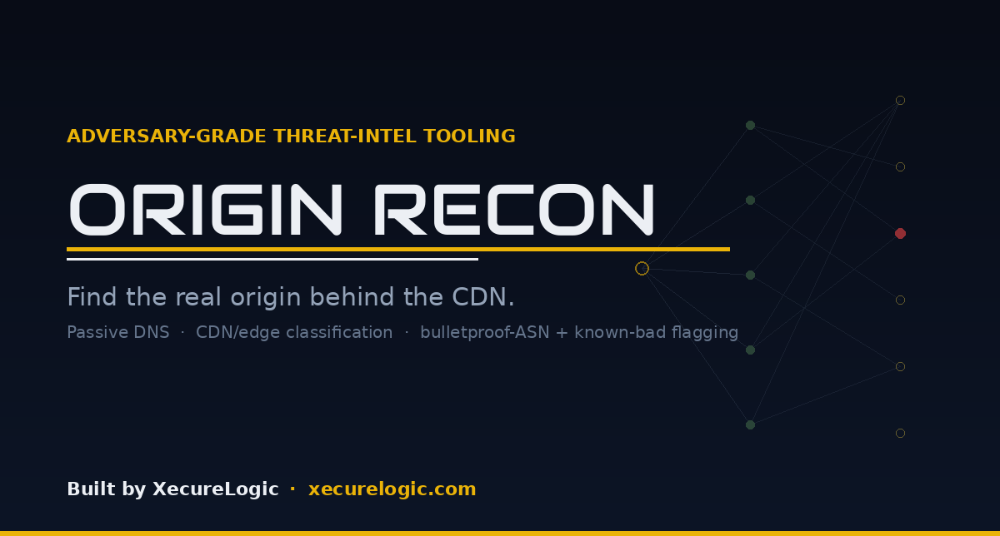
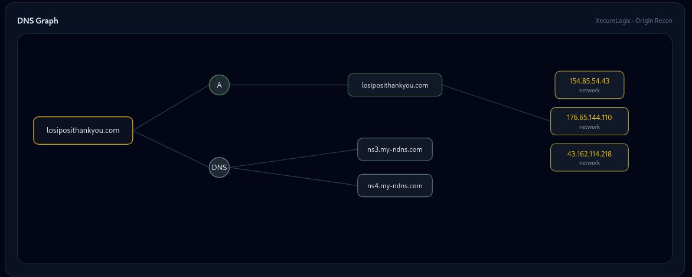
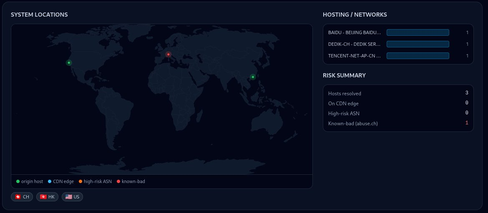
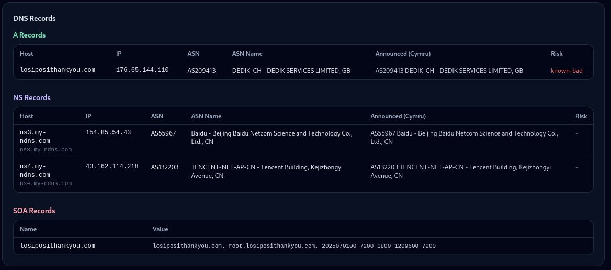
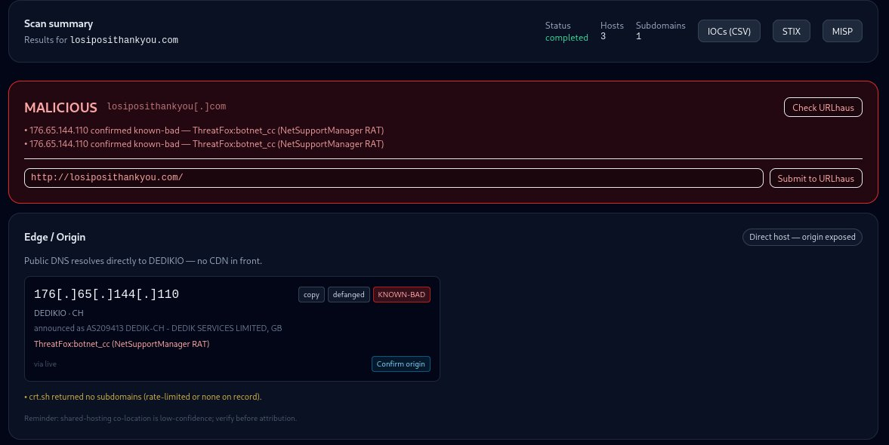
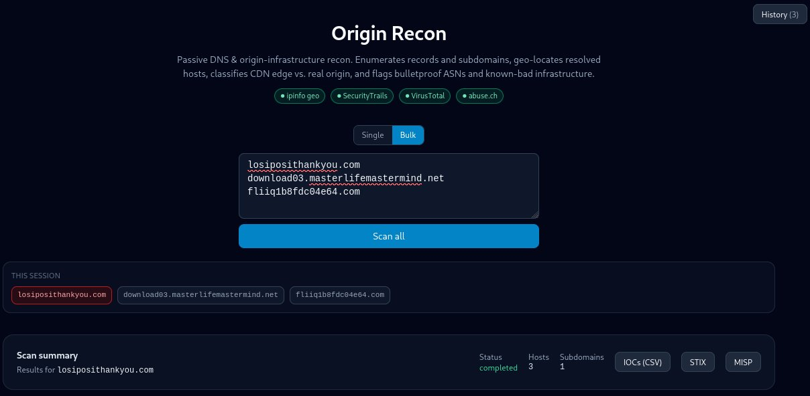

<p align="center">
  
</p>

# Origin Recon

**Built by:** [XecureLogic](https://xecurelogic.com) — xecurelogic.com

A self-contained, locally-run DNS / origin / attacker-infrastructure recon tool.
Give it a domain and it does in one pass what normally takes a dozen browser tabs:
maps the DNS, classifies CDN edge vs. real origin, geo-locates the hosts, and flags
bulletproof ASNs and abuse.ch-confirmed known-bad infrastructure.

FastAPI backend + React/Vite/Tailwind frontend. Runs on your machine; API keys and
target data never leave your box.

## Screenshots

<p align="center">
  <br>
  <em>The scan interface. Single or bulk mode, the live enrichment sources lit up across the top, and this session's scans as click-through chips.</em>
</p>

<p align="center">
  <br>
  <em>The headline verdict — MALICIOUS — with the reasoning, the defanged origin IOC, and one-click actions to check or report the URL to URLhaus.</em>
</p>

<p align="center">
  <br>
  <em>The DNS graph — apex to record types to resolved hosts to networks, laid out so the structure reads in seconds.</em>
</p>

<p align="center">
  <br>
  <em>Resolved hosts placed on a real-projection world map, color-coded by role and risk, with a hosting breakdown and a risk summary.</em>
</p>

<p align="center">
  <br>
  <em>The full DNS record tables — A, NS, SOA — each row enriched with ASN, the Team Cymru-announced origin, and a per-record risk flag.</em>
</p>

## What it does

For a target domain it performs **passive** OSINT recon and renders:

- **Headline verdict** — `MALICIOUS` / `SUSPICIOUS` / `NO MALICIOUS SIGNALS` / `INCONCLUSIVE`, with the reasoning stated plainly
- **DNS records** — A/AAAA/MX/NS/TXT/SOA, each enriched with ASN and risk flag
- **Real subdomain enumeration** via Certificate Transparency (crt.sh) — not a guess list
- **Geo-located hosts** on an accurate world map (Natural Earth projection), markers colored by role/risk
- **Edge / Origin classification** — whether the apex sits behind a CDN (masked) or resolves to a real host (exposed)
- **Origin candidates** from passive-DNS history (pre-CDN A records)
- **Authoritative ASN** per host via Team Cymru (reconciles RDAP/geo disagreements)
- **Bulletproof-ASN flagging** via Spamhaus ASN-DROP
- **Known-bad confirmation** via abuse.ch ThreatFox + URLhaus
- **Defanged IOCs** with copy buttons, plus export to **CSV**, **STIX 2.1**, and **MISP** event JSON
- **Bulk scanning** (paste a list, capped at 50, run concurrently)
- **Scan history** — every scan persisted locally, searchable, one-click recall
- **Active origin confirmation** (opt-in) — fetches a candidate with a spoofed `Host` header to verify it serves the target site; refuses private IPs and reports *inconclusive* rather than guessing
- **URLhaus submission** (gated) — contribute confirmed-malicious URLs back to the community

All sources are read-only/passive by default. The engine fails safe per source (a down
or keyless source degrades that section with a note; it never fabricates data).

## Quick start (one command)

```bash
./run.sh
```
Then open http://localhost:8000

`run.sh` creates a venv, installs backend deps, builds the frontend, serves the built
UI from the backend on port 8000, and opens your browser. `./run.sh --dev` runs the
hot-reload dev server instead. Ctrl+C stops everything.

## Optional API keys (enable richer enrichment)

Drop them in a `.env` at the project root (preferred) or in `backend/.env`. None are
hardcoded; each unlocks one module and the app degrades gracefully without it.

```bash
export IPINFO_TOKEN=...            # precise geolocation + ASN (raises rate limits)
export SECURITYTRAILS_API_KEY=...  # passive-DNS history (best for unmasking origins)
export VT_API_KEY=...              # passive-DNS history (VirusTotal)
export ABUSECH_AUTH_KEY=...        # known-bad confirmation (free: https://auth.abuse.ch/)
```

The header shows which enrichments are active. Without any keys you still get DNS, CT
subdomains, RDAP ASN, Team Cymru announced ASN, Spamhaus risk flagging, and approximate
(country-centroid) geolocation.

The status endpoint reports only **whether** a source is enabled — it never returns the
key. `.env` is git-ignored; keep it that way.

## Manual / dev mode

Backend:
```bash
cd backend
python3 -m venv .venv && source .venv/bin/activate
pip install -r requirements.txt
python -m uvicorn app.main:app --host 0.0.0.0 --port 8000
```
Frontend (hot reload, separate terminal):
```bash
cd frontend
npm install
npm run dev          # http://localhost:5173
```

## Notes

- Only scan domains you are authorized to assess.
- IP enrichment runs concurrently; a domain with many subdomains still completes in seconds.
- The world map is bundled offline (`frontend/src/assets/countries-110m.json`), so the app needs no external map service.
- The active origin-confirmation probe is the only feature that touches target infrastructure directly; it is opt-in per candidate.
